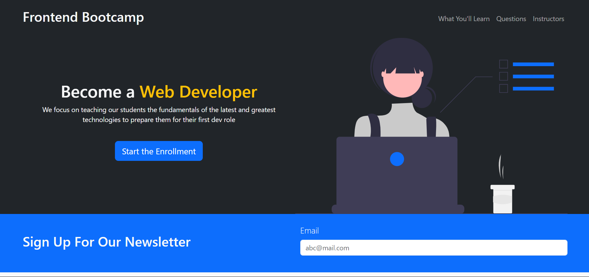
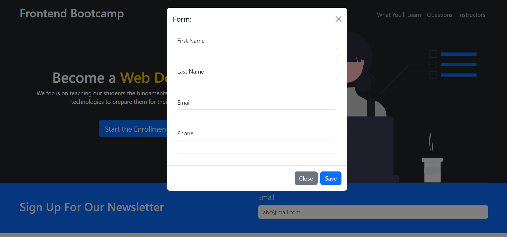

# Frontend Bootcamp Website

Welcome to the Frontend Bootcamp Website, a project built with Bootstrap.

## Overview

This website serves as a comprehensive resource for frontend development enthusiasts, offering courses, resources, and community engagement opportunities.

## Features

- Responsive design using Bootstrap grid system.
- Navigation bar for easy access to different sections.
- Course listings and descriptions.
- Registration forms for bootcamp enrollment.
- Interactive elements like carousels or modals if implemented.

## Technologies Used

- HTML5
- CSS3 (Bootstrap)
